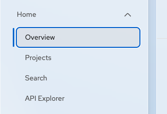
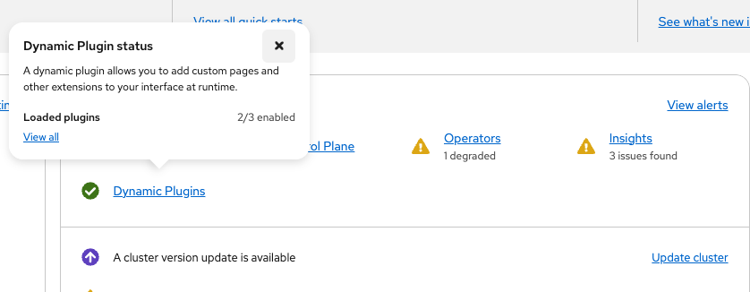
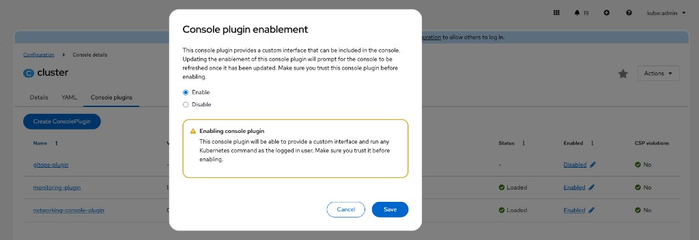
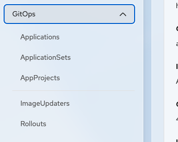

# Enable the GitOps Console plugin

The GitOps Console plugin is enabled by default after you install the Red Hat OpenShift GitOps Operator. If you disable the plugin, you can enable it manually.

## Prerequisites

* You have installed the Red Hat OpenShift GitOps Operator.
* You have access to the OpenShift web console with cluster administrator permissions.

## Procedure

1. In the OpenShift web console, navigate to **Home** → **Overview**.

   

2. In the **Status** panel, click **Dynamic Plugins**.

   

   A popup appears with a link to view all dynamic plugins.

3. Click **View all**.

4. Under the **Console plugins** tab, find **gitops-plugin**.

5. If the plugin is disabled, click **Enable**.

   

   The browser might require a refresh. After refreshing, the page indicates that the plugin is **Enabled**.

## Verification

* Navigate to **GitOps** in the navigation menu and verify that you can access Applications, ApplicationSets, AppProjects, ImageUpdaters, and Rollouts pages.

  

## Disable the plugin

Use the same **Console plugins** list and disable **gitops-plugin**.

### Disable or enable with the CLI

The console loads plugins listed in `spec.plugins` on `console.operator.openshift.io/cluster`.

1. Check which plugins are enabled:

   ```bash
   oc get console.operator.openshift.io cluster -o jsonpath='{.spec.plugins}{"\n"}'
   ```

2. To enable **gitops-plugin**:

   ```bash
   PLUGIN_PATCH='[{"op":"add","path":"/spec/plugins/-","value":"gitops-plugin"}]'
   oc patch console.operator.openshift.io cluster --type=json -p "${PLUGIN_PATCH}"
   ```

   Skip this step if `gitops-plugin` is already in the list from the previous command.

3. To disable **gitops-plugin**, edit the Console operator and remove `gitops-plugin` from `spec.plugins`:

   ```bash
   oc edit console.operator.openshift.io cluster
   ```

   Example:

   ```yaml
   spec:
     plugins:
       - monitoring-plugin
       # remove: - gitops-plugin
   ```

4. Refresh the browser after the change. The **GitOps** entry disappears from the navigation when the plugin is disabled.

## Multi-instance configuration

The GitOps Console plugin is cluster-scoped. A single plugin deployment serves all Argo CD instances on the cluster; you do not install a separate plugin for each instance.

When multiple Argo CD instances exist in different namespaces, their resources appear together in the GitOps pages. Use the namespace selector to limit the view to one namespace or to browse across namespaces.

The **View in Argo CD** action opens the selected application in the Argo CD user interface. This action requires a Route to the Argo CD server.

## Related information

* [Getting started](getting-started.md)
* [Troubleshooting](troubleshooting.md)
