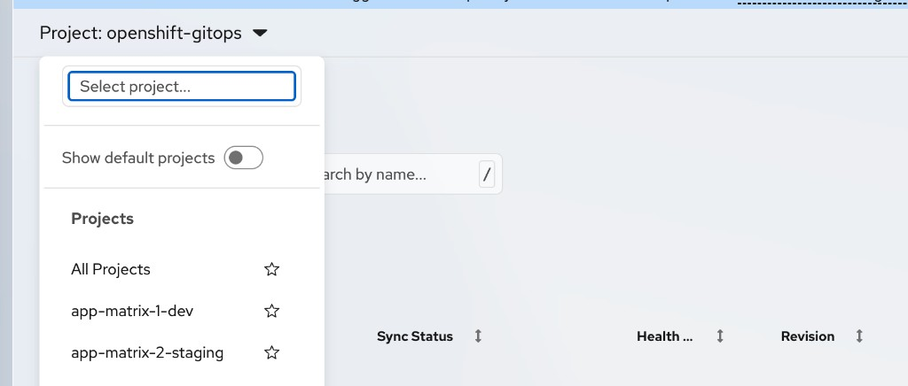
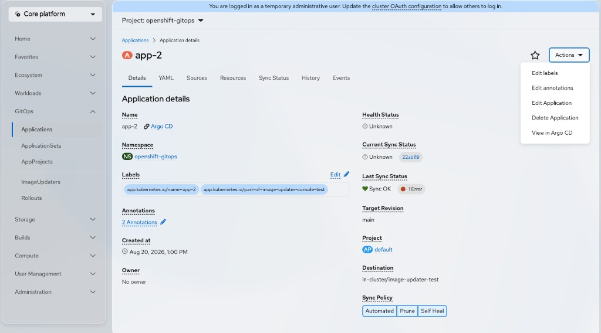
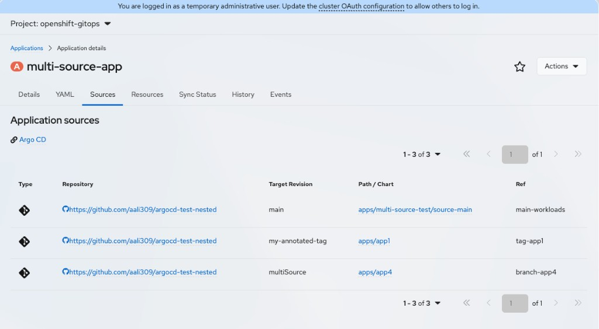
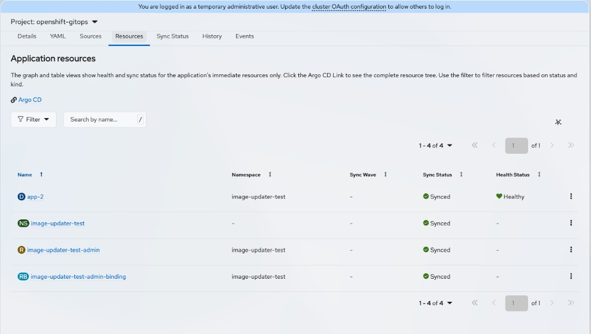

# Applications in the GitOps Console

The GitOps Console plugin provides list and details pages for Argo CD Applications in the OpenShift web console. You can search and filter Applications, create them from a YAML template, review health and sync status, inspect sources, managed resources, sync history, and events.

> **IMPORTANT**
>
> The plugin displays the health status stored on the Application custom resource (CR). If health is missing or incorrect, set `controller.resource.health.persist: "true"` in the `argocd-cmd-params-cm` ConfigMap. For more information, see [Troubleshooting](troubleshooting.md).

## Prerequisites

* You have access to the OpenShift web console.
* The GitOps Console plugin is enabled. See [Enable the GitOps Console plugin](admin-enable-plugin.md).
* You can list Applications in the selected namespace (or across namespaces, depending on your permissions).

## Applications list page

1. In the **Administrator** or **Core platform** perspective, navigate to **GitOps** → **Applications**.

2. Optional: Use the **Project** dropdown to limit the list to one project (namespace), or choose all projects to view Applications across namespaces.

   

### Filter and search

Use the list page controls to narrow results:

* **Filter**: Use **Filter** to narrow by:
  * **Sync Status**: Synced, OutOfSync, Unknown
  * **Health Status**: Healthy, Progressing, Suspended, Degraded, Missing, Unknown
* **Search**: Use the search field to match by **Name** or **Label**. Choose the mode from the dropdown next to the field (for example, **Name** with **Search by name...**).

You can combine search and filters. Clear individual chips or use **Clear all filters**. Changing filters, search, or project returns pagination to page 1. See [Filter, search, and paginate resources](filter-resources.md).

### Table columns

The Applications table includes:

| Column | Description |
| --- | --- |
| **Name** | Application name, with a link to the details page. |
| **Namespace** | Namespace of the Application. |
| **Sync Status** | Current sync state, with quiet operation state when a sync is in progress or recently finished. |
| **Health Status** | Overall Application health. |
| **Revision** | Target revision (or **HEAD**). Multi-source Applications may show additional revision count. |
| **Labels** | Application labels. |
| **App Project** | AppProject that this Application belongs to. |
| **Actions** | Row kebab menu. |

### Pagination

Browse results in pages of **10**, **20**, **50**, or **100** items (default **50**). Search and filters change which rows are included. Page and page size are stored in the URL. See [Filter, search, and paginate resources](filter-resources.md).

### Create an Application

1. On the Applications list page, click **Create Application**.

2. The console opens the YAML editor with a starter Application template. The template includes placeholders for name, destination, project, repository URL, path, target revision, and sync policy (`automated`, `prune`, `selfHeal`).

   The editor includes a **Schema** side panel that describes Application fields, and a **Download** control to save the YAML.

3. Edit the YAML for your repository and cluster destination, then create the resource.

Application creation uses YAML only. There is no guided form.

### Row actions

From the row kebab, you can:

* **Edit labels**
* **Edit annotations**
* **Edit Application** (opens the YAML editor)
* **Delete Application**

> **NOTE**
>
> The Application kebab does not include **Sync** or **Rollback**. Sync policy toggles on the Details tab (**Automated**, **Prune**, **Self Heal**) and YAML changes only configure sync policy or the manifest; they do not run a one-time sync. For a manual sync or rollback, use the Argo CD UI or the `argocd` CLI. The History tab lists past revisions for reference; it does not roll back.

### Favorites

You can mark Applications as favorites by using the console favorites control on the list and details pages. Favorites follow your console user settings.

## Application details page

1. From the Applications list, click an Application name.

2. The details page breadcrumb shows **Applications** → **Application details**.

3. Use the page header **Actions** menu for the same edit, delete, and (when available) **View in Argo CD** actions as the list. **View in Argo CD** requires a Route to the Argo CD server.

The details page includes the following tabs.

### Details tab

The **Details** tab summarizes identity, status, and sync policy.

**Application summary (left)**

* **Name**, with an optional **Argo CD** link when a Route is available
* **Namespace**
* **Labels**, with **Edit**
* **Annotations**
* **Created at**
* **Owner**

**Application status and destination (right)**

* **Health Status**: Overall health of the Application
* **Current Sync Status**: Sync state and revision information
* **Last Sync Status**: Last operation state, with Application conditions when present (errors, warnings, or notices)
* **Target Revision**: Desired revision, or **HEAD**
* **Project**: Link to the AppProject
* **Destination**: Destination cluster and namespace
* **Sync Policy** toggles (when you have update permission):
  * **Automated**
  * **Prune** (requires automated sync)
  * **Self Heal** (requires automated sync)

Without update permission, the sync policy toggles are disabled.

### YAML tab

The **YAML** tab provides a live editor for the Application manifest. Use it to inspect or update the full resource definition.

The editor includes a **Schema** side panel that describes Application fields, and a **Download** control to save the YAML.

### Sources tab

The **Sources** tab lists repository sources for the Application (single-source and multi-source).

Section title: **Application sources**.

The sources table includes:

| Column | Description |
| --- | --- |
| **Type** | Source type such as **Git**, **Helm**, or **OCI**. |
| **Repository** | Repository URL. |
| **Target Revision** | Desired revision for that source. |
| **Path / Chart** | Git path or Helm chart (root path can appear as **(root)**). |
| **Ref** | Source reference name when used in multi-source Applications. |

The table supports pagination. An Argo CD link on the tab can open source parameters in the Argo CD UI when a Route is available.

### Resources tab

The **Resources** tab shows the Application’s immediate managed resources in list or graph form.

Section title: **Application resources**.

The graph and table show health and sync status for the Application’s **immediate** resources only, not the full Argo CD resource tree. Use the **Argo CD** link on the tab to open the complete hierarchy in the Argo CD UI.

#### List view and graph view

* Switch between **List view** and **Graph view**. The console remembers your preference.
* Filters apply to both views:
  * **Sync Status**
  * **Health Status**
  * **Kind**
  * Search by resource name
* In list view, the table columns include **Name**, **Namespace**, **Sync Wave**, **Sync Status**, **Health Status**, and row actions.

  

* Row actions can include **View in Argo CD** and **Delete**, depending on the resource and your permissions.
* The list supports sorting and pagination. See [Filter, search, and paginate resources](filter-resources.md).

#### Graph view

* Pan, zoom, and select nodes.
* Toggle OpenShift shapes and Argo CD shapes.
* Group or ungroup resources of the same kind.
* Context-menu actions on nodes can include viewing details, editing labels and annotations, deleting resources, editing the Application, and opening **View in Argo CD**.

For more about graph controls, see [Graphs and topology views](topology.md).

### Sync Status tab

The **Sync Status** tab shows the latest sync operation and the resources involved in that sync.

**Sync status**

* **Operation**, with conditions when present
* **Phase**
* **Message**
* **Initiated By** (for example, a user name or automated sync policy)
* **Started At**, **Duration**, and **Finished At**

**Resources Last Synced**

A paginated table of resources from the last sync operation:

| Column | Description |
| --- | --- |
| **Name** | Resource name. |
| **Namespace** | Resource namespace. |
| **Status** | Sync result for that resource. |
| **Hook** | Hook information when applicable. |
| **Message** | Status message. |

Row actions follow the same resource actions pattern as the Resources tab.

### History tab

The **History** tab shows Application sync and deployment history.

Section title: **Sync history**.

The history table includes:

| Column | Description |
| --- | --- |
| **ID** | History entry identifier. |
| **Deploy Started At** | When the deploy started. |
| **Deployed At** | When the deploy completed. |
| **Initiated By** | User or **Automated**. |
| **Revision(s) and Source Repo URL(s)** | Revision and repository information for the entry. |

Entries display newest first by default. Column sorting keeps the direction you select. The table supports pagination.

This tab is informational. It does not provide an in-console **Rollback** action. Use the Argo CD UI or CLI to roll back.

### Events tab

The **Events** tab shows Kubernetes events for the Application object, using the standard console event stream for that resource.

## Related information

* [Filter, search, and paginate resources](filter-resources.md)
* [Graphs and topology views](topology.md)
* [ApplicationSets in the GitOps Console](applicationsets.md)
* [AppProjects in the GitOps Console](appprojects-rbac.md)
* [Troubleshooting](troubleshooting.md)
