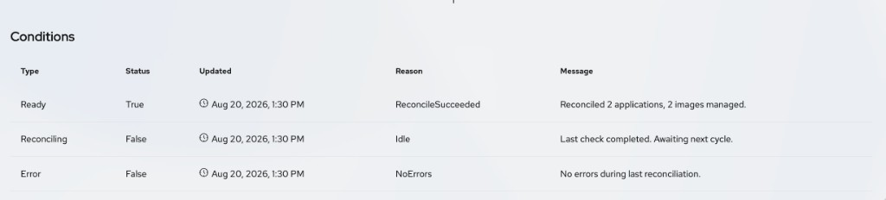

# ImageUpdaters in the GitOps Console

The GitOps Console plugin provides list and details pages for Argo CD Image Updater custom resources in the OpenShift web console. You can search and filter ImageUpdaters, create them from a YAML template, and review matched applications, managed images, and recent update activity.

The **ImageUpdaters** page is available when the ImageUpdater custom resource definition is installed on the cluster.

## Prerequisites

* You have access to the OpenShift web console.
* The GitOps Console plugin is enabled. See [Enable the GitOps Console plugin](admin-enable-plugin.md).
* The ImageUpdater CRD is installed on the cluster.
* You can list ImageUpdaters in the selected namespace (or across namespaces, depending on your permissions).

## List page

1. In the **Administrator** or **Core platform** perspective, navigate to **GitOps** → **ImageUpdaters**.

2. Optional: Use the **Project** dropdown to limit the list to one project (namespace), or choose all projects.

The ImageUpdaters list page includes:

* **Filtering**: Filter ImageUpdaters by:
  * **Apps**: Has Apps, No Apps
  * **Ready**: Ready, Not Ready
* **Search**: Use the search field to match by **Name** or **Label**. Choose the mode from the dropdown next to the field.
* **Create action**: Click **Create ImageUpdater** to open the YAML editor with a default ImageUpdater template
* **Table columns**: **Name**, **Namespace**, **Apps**, **Images**, **Last Checked**, **Ready**, **Labels**, and row actions
* **Pagination**: Browse results in pages of 10, 20, 50, or 100 items (default 50). Search and filters change which rows are included. See [Filter, search, and paginate resources](filter-resources.md).

> **NOTE**
>
> Creation uses the YAML editor. The console does not provide an ImageUpdater form wizard.

### Row actions

From the row kebab, you can:

* **Edit labels**
* **Edit annotations**
* **Edit ImageUpdater** (opens the YAML editor)
* **Delete ImageUpdater**

## ImageUpdater details page

1. From the ImageUpdaters list, click an ImageUpdater name.

2. The details page breadcrumb shows **ImageUpdaters** → **ImageUpdater details**.

3. Use the page header **Actions** menu for the same edit and delete actions as the list.

The details page includes the following tabs.

### Details tab

The **Details** tab summarizes identity and ImageUpdater status.

Section title: **ImageUpdater details**.

**Summary (left)**

* **Name**
* **Namespace**
* **Labels**, with **Edit**
* **Annotations**
* **Created at**

**Status and configuration (right)**

* **Ready**: Whether the last reconciliation completed without errors (**True** or **False**)
* **Applications Matched**: Number of applications matched by this ImageUpdater
* **Images Managed**: Number of images eligible for update checking
* **Last Checked At**: When the controller last checked for image updates
* **Last Updated At**: When the controller last performed an image update
* **Observed Generation**: Generation of the resource that was last reconciled

**Conditions**

When the ImageUpdater reports status conditions, a **Conditions** section appears below the summary. Use this table to diagnose reconciliation problems. Common condition types include **Ready**, **Reconciling**, and **Error**.

### Recent Updates tab

The **Recent Updates** tab shows image updates from the most recent reconciliation cycle in a paginated, sortable table.

Section title: **Recent Updates**.

| Column | Description |
| --- | --- |
| **Alias** | Image alias from the ImageUpdater configuration. |
| **Image** | Container image that was updated. |
| **New Version** | New image version written by the updater. |
| **Apps Updated** | Number of applications updated for this change. |
| **Updated At** | When the update was recorded. |
| **Message** | Status or detail message for the update. |

If no updates were recorded in the last cycle, the tab shows an empty state. See [Filter, search, and paginate resources](filter-resources.md) and [Troubleshooting](troubleshooting.md).

### YAML tab

The **YAML** tab provides a live editor for the ImageUpdater manifest. Use it to inspect or update the full resource definition.

The editor includes a **Schema** side panel that describes ImageUpdater fields, and a **Download** control to save the YAML.

## Related information

* [Filter, search, and paginate resources](filter-resources.md)
* [Applications in the GitOps Console](applications.md)
* [Troubleshooting](troubleshooting.md)
