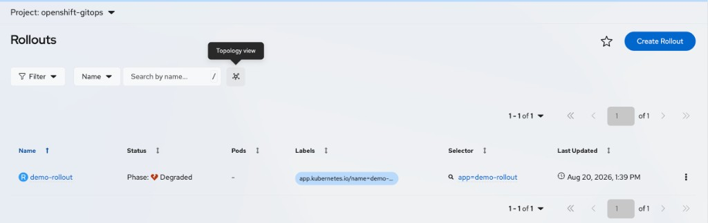

# Rollouts in the GitOps Console

The GitOps Console plugin provides list and details pages for Argo Rollouts in the OpenShift web console. You can search and filter Rollouts, create them from a YAML template, scale replicas, inspect revisions and pods, and open Rollouts in the Topology view.

The **Rollouts** page is available after you install the Red Hat OpenShift GitOps Operator.

## Prerequisites

* You have access to the OpenShift web console.
* The GitOps Console plugin is enabled. See [Enable the GitOps Console plugin](admin-enable-plugin.md).
* You can list Rollouts in the selected namespace (or across namespaces, depending on your permissions).

## List page

1. In the **Administrator** or **Core platform** perspective, navigate to **GitOps** → **Rollouts**.

2. Optional: Use the **Project** dropdown to limit the list to one project (namespace), or choose all projects.

The Rollouts list page includes:

* **Filtering**: Filter Rollouts by:
  * **Rollout Status**: Healthy, Paused, Progressing, Degraded
* **Search**: Use the search field to match by **Name** or **Label**. Choose the mode from the dropdown next to the field.
* **Create action**: Click **Create Rollout** to open the YAML editor with a default Rollout template
* **Table columns**: **Name**, **Namespace**, **Status**, **Pods**, **Labels**, **Selector**, **Last Updated**, and row actions
* **Pagination**: Browse results in pages of 10, 20, 50, or 100 items (default 50). Search and filters change which rows are included. See [Filter, search, and paginate resources](filter-resources.md).

When the list has results, a **Topology view** control opens the Topology graph for the current namespace (or all namespaces).

> **NOTE**
>
> Creation uses the YAML editor. The console does not provide a Rollout form wizard.

### Row actions

From the row kebab, you can:

* **Edit labels**
* **Edit annotations**
* **Edit Rollout** (opens the YAML editor)
* **Delete**

## Topology integration

Rollout topology requires OpenShift Container Platform **4.19** or later (not available in the release-4.18 plugin).

| Perspective | Navigation |
| --- | --- |
| **Core platform** | **Workloads** → **Topology** |
| **Developer** | **Topology** |

The cluster-wide perspective may be labeled **Administrator** or **Core platform** depending on your OpenShift version.

See [Rollouts in Topology](topology.md#rollouts-in-topology) for the full Topology page layout.

When those conditions are met:

* Rollout nodes include a visual decorator
* Selecting a Rollout opens **Details** and **Overview** sidebar tabs
* Context actions include **Edit Rollout** and **Delete Rollout**

Use the **Topology view** control on the Rollouts list, Details tab, or Pods tab to open that graph.

From Details or Pods, the Rollout is selected in the graph. For more detail, see [Rollouts in Topology](topology.md#rollouts-in-topology).

## Rollout details page

1. From the Rollouts list, click a Rollout name.

2. The details page breadcrumb shows **Rollouts** → **Rollout details**.

3. Use the page header **Actions** menu for the same edit and delete actions as the list. On the **Revisions** tab, the header actions switch to revision controls (**Promote**, **Full Promote**, **Abort**, **Retry**, **Restart**).

The details page includes the following tabs.

### Details tab

The **Details** tab summarizes identity, scale, strategy, and status.

Section title: **Rollout details**.

**Summary (left)**

* **Name**, with a **Topology view** control that opens the Topology graph for this Rollout
* **Namespace**
* **Labels**, with **Edit**
* **Annotations**
* **Created at**
* **Owner**

**Status and configuration (right)**

* **Replicas**: Desired replica count, with inline scale controls when you have update permission
* **Status**: Current rollout phase (**Healthy**, **Paused**, **Progressing**, **Degraded**, or similar), with an optional status message
* **Strategy**: **Blue-Green** or **Canary**
* Strategy-specific fields:
  * **Canary**: **Stable Service**, **Canary Service**, and **Analysis Templates**
  * **Blue-Green**: **Active Service** and **Preview Service**

**Conditions**

Below the summary, the **Conditions** section shows Rollout status conditions. If none are reported, the section shows **No conditions found**.

### YAML tab

The **YAML** tab provides a live editor for the Rollout manifest. Use it to inspect or update the full resource definition.

The editor includes a **Schema** side panel that describes Rollout fields, and a **Download** control to save the YAML.

### Revisions tab

The **Revisions** tab shows the Rollout and its ReplicaSet revision history in a tree table, similar to `oc argo rollouts get rollout` (including live updates comparable to `--watch`).

Section title: **Rollout Revisions**.

Toolbar and header actions:

* **Promote**, **Full Promote**, and **Abort** — available when the Rollout is **Progressing** or **Paused**
* **Retry** — available when the Rollout is **Degraded**
* **Restart** — always available

| Column | Description |
| --- | --- |
| **Name** | Rollout, revision ReplicaSet, or nested pod name. |
| **Kind** | Resource kind. |
| **Status** | Health or phase for the row. |
| **Age** | Age of the resource. |
| **Info** | Labels such as **Stable**, **Active**, **Preview**, or **Canary**, plus pod and image summary. |

**Rollback** is available from a non-current revision’s row actions when you have patch permission. Rollback is disabled for the current revision. See [Troubleshooting](troubleshooting.md).

### Pods tab

The **Pods** tab lists pods associated with the Rollout. The table supports filtering, search, sorting, and pagination. A **Topology view** control can open the graph with this Rollout selected.

* **Filtering**: Filter pods by **Health Status** (Running, Pending, Terminating, CrashLoopBackOff, Completed, Failed, Unknown)
* **Table columns**: **Name**, **Namespace**, **Traffic**, **Status**, **Ready**, **Restarts**, **Owner**, **Memory**, **CPU**, **Created At**, and row actions

Pod row actions can include **Edit labels**, **Edit annotations**, **Edit Pod**, and **Delete**. See [Filter, search, and paginate resources](filter-resources.md).

### Events tab

The **Events** tab shows Kubernetes events for the Rollout object, using the standard console event stream for that resource.

## Related information

* [Filter, search, and paginate resources](filter-resources.md)
* [Rollouts in Topology](topology.md#rollouts-in-topology)
* [Troubleshooting](troubleshooting.md)
