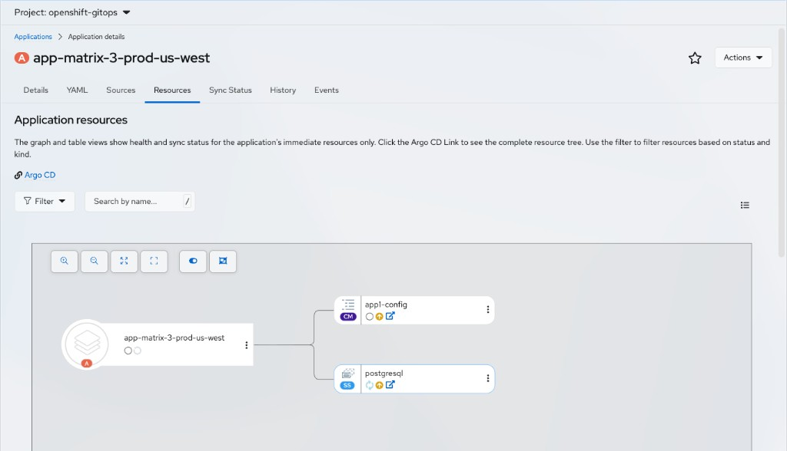
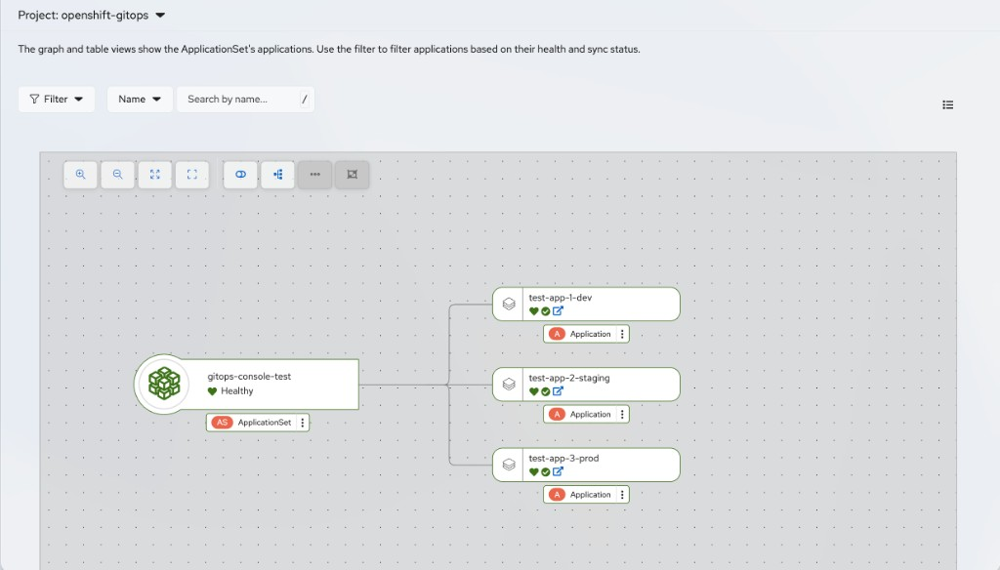
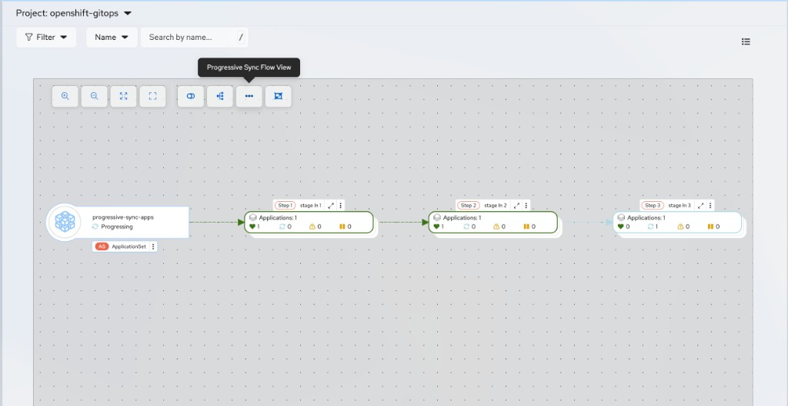
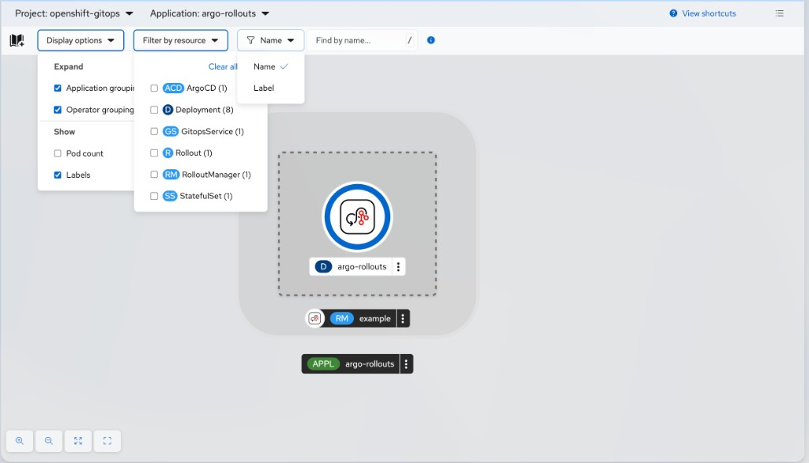

# Graphs and Topology Views

The GitOps Console plugin provides two kinds of graphical experience:

* **Graph view** — In-plugin graphs on Application **Resources** and ApplicationSet **Applications** tabs
* **Topology** — Rollout workloads on the console **Topology** page (path depends on OpenShift version; see [Rollouts in Topology](#rollouts-in-topology))

## Application resource graph

On an Application, open the **Resources** tab and switch to **Graph view**.

The graph and table show immediate managed resources for the Application, not the full Argo CD resource tree.



* Pan, zoom, and select resources. Status filters apply to both the table and the graph.
* Related resources of the same kind can be grouped or ungrouped.
* Context-menu actions on graph nodes include viewing details, editing labels and annotations, deleting resources, and viewing resources in Argo CD.
* Use the Argo CD link on the tab to open the complete resource hierarchy in the Argo CD UI.

## ApplicationSet graphical view

On an ApplicationSet, open the **Applications** tab and switch to **Graph view**.

The graph shows Applications generated by the ApplicationSet. Use **Filter** and search to narrow by health and sync status. The list view on the same tab shows the same applications in table form.

### Standard ApplicationSet graph

When progressive sync is **not** configured, the graph uses an **owner reference** layout. The ApplicationSet node connects to each generated Application. Each Application node shows sync and health status. You can pan, zoom, group nodes, and open context actions from the graph toolbar.



### Progressive sync graph

When progressive sync is **enabled** on the ApplicationSet and the controller reports step status, switch the graph to **Progressive Sync Flow View** from the toolbar (the control is disabled until step status is available).



In this layout, Applications are grouped by **sync step** instead of shown flat under the ApplicationSet. Each step group shows:

* **Step number** and the step's label selector (for example, `stage in 1`)
* **Application count** for that step
* **Status counts** for healthy, syncing, warning, and waiting Applications in the step

The controller advances one step at a time. A step must reach a healthy state before the next step starts syncing. In the example above, Step 1 and Step 2 are healthy, and Step 3 is progressing.

Progressive sync requires:

1. The ApplicationSet controller feature enabled on the cluster:

   ```bash
   oc patch configmap argocd-cmd-params-cm -n openshift-gitops --type merge -p \
     '{"data":{"applicationsetcontroller.enable.progressive.syncs":"true"}}'
   oc rollout restart deployment openshift-gitops-applicationset-controller -n openshift-gitops
   ```

   Confirm the deployment name with `oc get deploy -n openshift-gitops | grep applicationset` if it differs on your cluster.

2. A `RollingSync` strategy with `rollingSync.steps` defined on the ApplicationSet
3. Generated Applications labeled so they match each step's selector

Example ApplicationSet strategy that syncs Applications labeled `stage=1`, then `stage=2`, then `stage=3`:

```yaml
apiVersion: argoproj.io/v1alpha1
kind: ApplicationSet
metadata:
  name: progressive-sync-apps
  namespace: openshift-gitops
spec:
  generators:
    - list:
        elements:
          - name: app-stage-1
            stage: '1'
          - name: app-stage-2
            stage: '2'
          - name: app-stage-3
            stage: '3'
  strategy:
    type: RollingSync
    rollingSync:
      steps:
        - matchExpressions:
            - key: stage
              operator: In
              values:
                - '1'
        - matchExpressions:
            - key: stage
              operator: In
              values:
                - '2'
        - matchExpressions:
            - key: stage
              operator: In
              values:
                - '3'
  template:
    metadata:
      name: '{{name}}'
      labels:
        stage: '{{stage}}'
    spec:
      project: default
      source:
        repoURL: https://github.com/example/repo.git
        targetRevision: HEAD
        path: apps/{{name}}
      destination:
        server: https://kubernetes.default.svc
        namespace: '{{name}}'
```

The `template.metadata.labels` values must match the `rollingSync.steps` selectors. Applications that do not match any step are not synced by RollingSync and must be synced manually.

This step-based flow is separate from **sync waves** on an Application's managed resources (the **Sync Wave** column on an Application **Resources** tab). Progressive sync controls the order in which Applications sync; sync waves control the order of resources within a single Application sync.

## Rollouts in Topology

Rollout topology integration requires OpenShift Container Platform **4.19** or later (not available in the release-4.18 plugin).

Open Topology using the path that matches your console layout:

| Perspective | Navigation |
| --- | --- |
| **Core platform** | **Workloads** → **Topology** |
| **Developer** | **Topology** |

The cluster-wide perspective may be labeled **Administrator** or **Core platform** depending on your OpenShift version.

From GitOps **Rollouts** pages, the **Topology view** control opens the same graph without using the navigation paths above.

When available, the Topology page includes the following, from top to bottom:

1. **Header**
   * **Project** and **Application** dropdowns scope which workloads appear
   * **View shortcuts** lists Topology keyboard and mouse shortcuts
   * Switch between **graph** and **list** view with the view control on the right of the header
2. **Toolbar**
   * **Display options**: Expand **Application groupings** or **Operator groupings**, and show or hide **Labels** and **Pod count**
   * **Filter by resource**: Limit results to selected kinds. **Rollout** appears in this list when Rollouts exist in the project (shown with the **R** badge)
   * **Find by name** or **Label**: Narrow visible workloads with the search field
3. **Graph or list**
   * In graph view, Rollout nodes include a visual decorator and can appear inside application or operator groupings
   * Selecting a Rollout opens **Details** and **Overview** sidebar tabs
   * Context actions include **Edit Rollout** and **Delete Rollout**



From the GitOps **Rollouts** list, Details tab, or Pods tab, use the **Topology view** control to open this graph. From Details or Pods, the selected Rollout is highlighted. See [Rollouts in the GitOps Console](rollouts.md).

## Related information

* [Applications in the GitOps Console](applications.md)
* [ApplicationSets in the GitOps Console](applicationsets.md)
* [Rollouts in the GitOps Console](rollouts.md)
* [Troubleshooting](troubleshooting.md)
